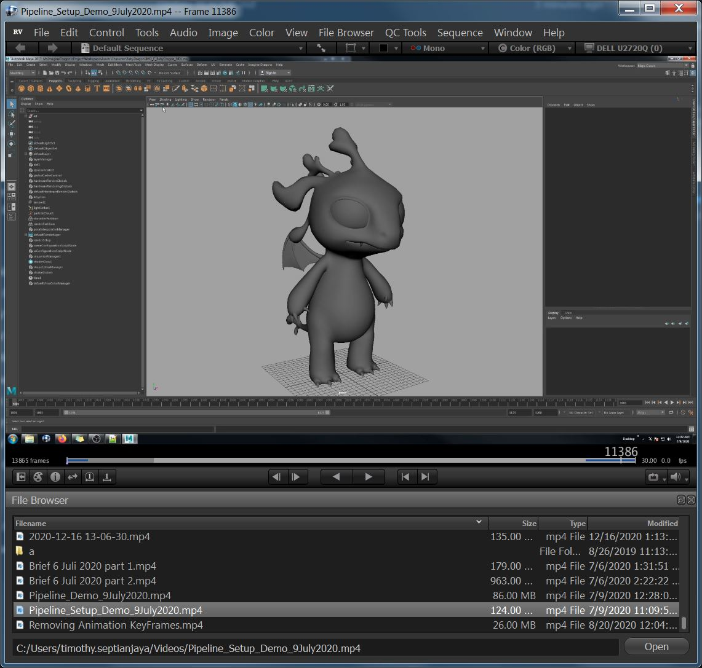

# RVFileBrowser

File Browser Plugin for Shotgun RV ex Tweak Software's 
Build for testing Purpose 
Tested on RV 7.1.0 

Install:
- Download FileBrowser-{version}.rvpkg
- Open RV
- On RV menu go to Preferences
- On RV Preferences go to Packages Tab
- Click Add Packages Button and choose the downloaded rvpkg
- Choose Install Location
- Check Installed and Load checkbox of the installed package
- Restart RV
- On RV Menu go to File Browser
- Show File Browser

Feature:
- Open File
- Drag and Drop File
